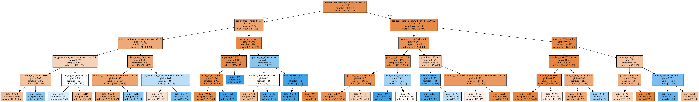
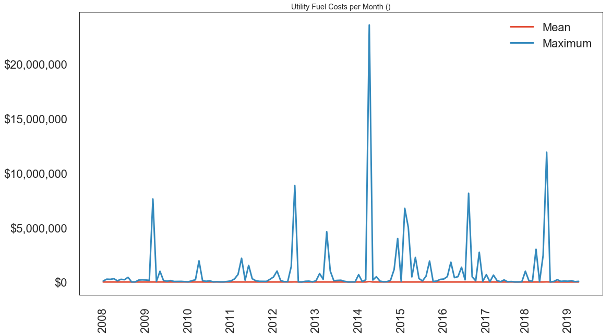
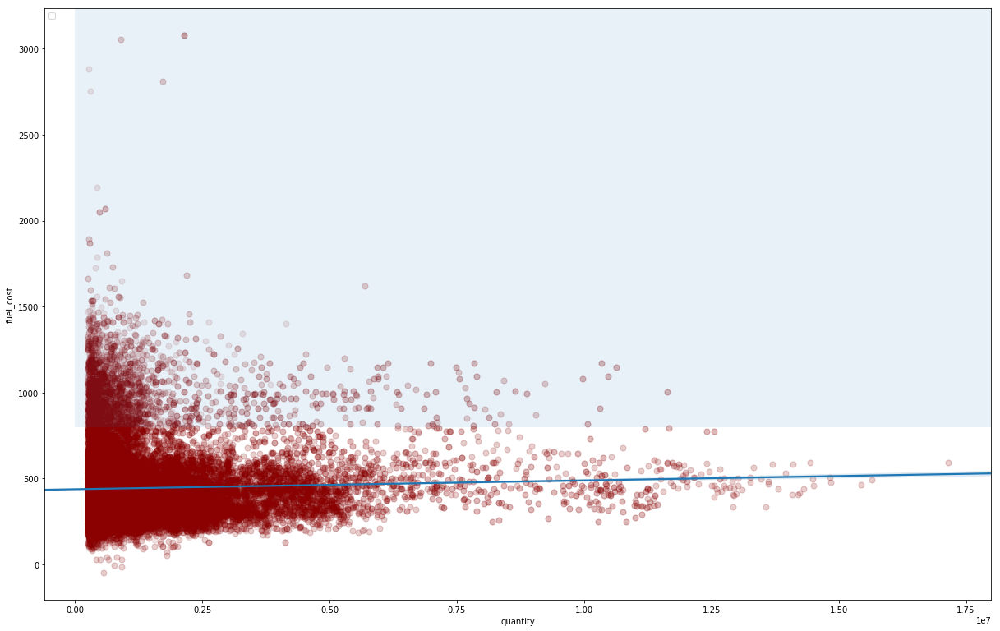
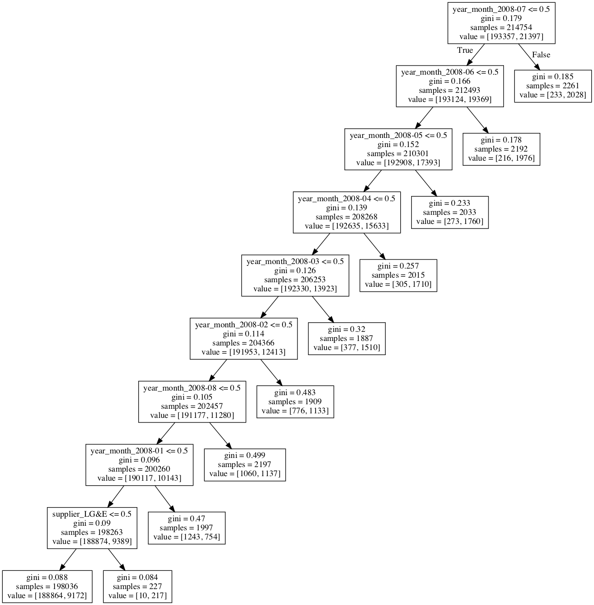
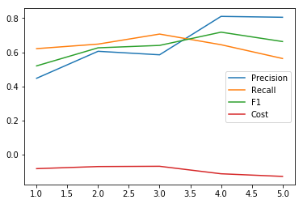
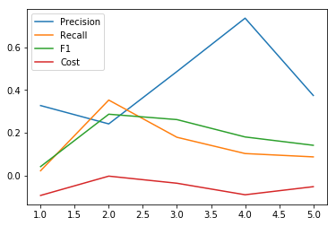
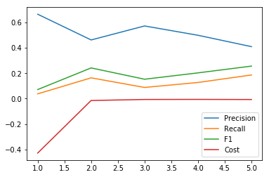
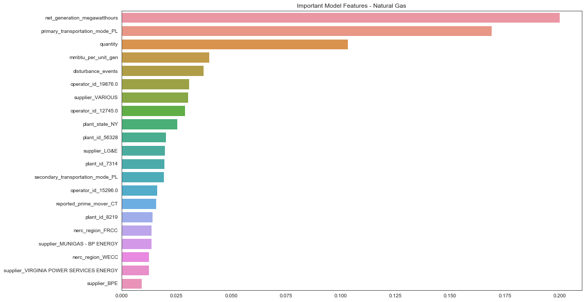
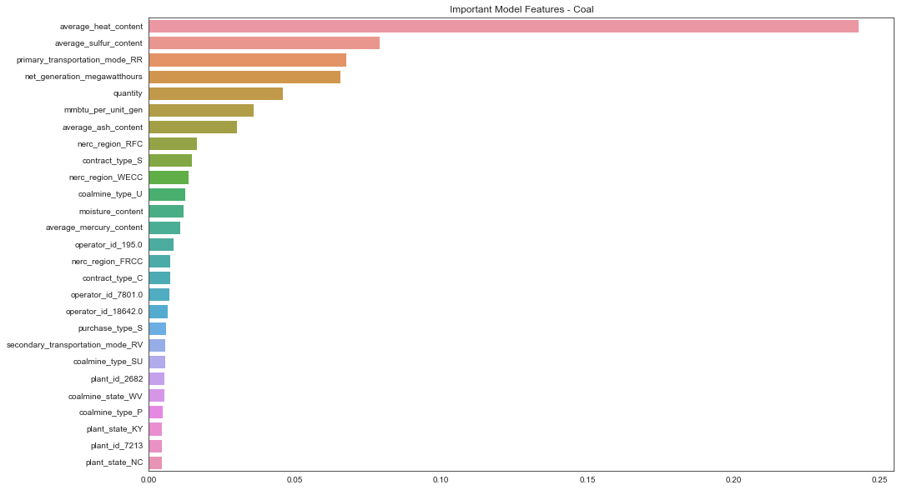
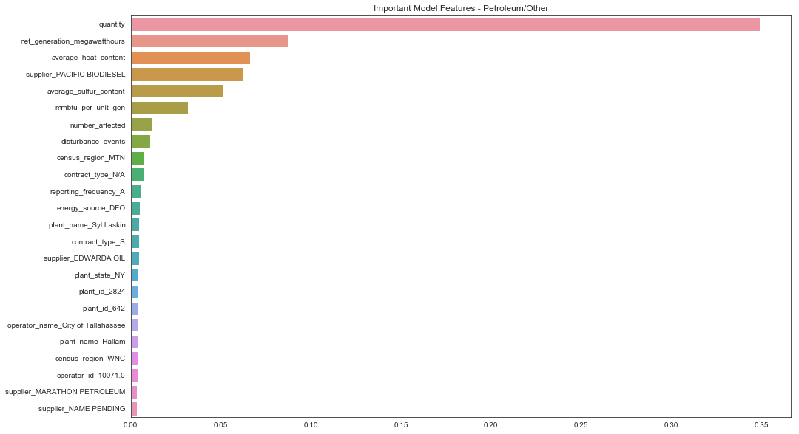

# Analysis of fuel cost data from EIA

## Summary

A classification of utility fuel cost price spikes based on quantity purchased, transportation mode, supplier, operator, power plant, energy generation, efficiency, coal mine, fuel quality, disruptions in service, and reporting type.

Data modeled using Decision Tree with 80% precision on average, 94% AUC, and a cost-benefit metric of 1% (benefit) with intermittement benefits of up to 40%. Benefit is determined by a custom cost metric that imposes a small cost on false positives and a larger benefit to true positives. 

Fuels were modeled separately—one for coal, natural gas, and petroleum/other respectively—because each had their own distinct features, different price points, and unique trends.

By fuel, the model returned a 9.2% benefit for coal, 9% benefit for natural gas, and a 5.4% benefit for petroleum/other fuels. 

## Description

What drives the cost of electricity can be a complicated question. Weather conditions like the Polar Vortex can drive sharp spikes in prices for fuel, and market fluctuations and accusations of manipulation [often end in protracted lawsuits](https://www.bloomberg.com/news/articles/2019-07-12/darkest-california-power-market-lures-repeat-manipulation). 

The U.S. Energy Administration (EIA) puts out mountains of data on the subject that's ready to be analyzed.

Their energy industry data covers every kind of fuel and every way it could possibly be consumed. One particular data set is the Form 923 data that collects "detailed electric power data -- monthly and annually -- on electricity generation, fuel consumption, fossil fuel stocks, and receipts at the power plant and prime mover level."

This analysis will look at the data of fuel receipts for electricity generation from form 923, which includes how much utilities pay for their fuel generation. Each spreadsheet contains prices paid for fuel for Coal, Natural Gas, Petroleum, Petroleum Coke. Other energy sources like nuclear do not appear.

Potential features that drive price include contract type, quantity, the plant consuming the fuel, plant operator, provider of the fuel (e.g. coal mine), a variety of quality indicators for coal (average_ash_content, average_heat_content, average_mercury_content, average_sulfur_content, chlorine_content), or how it was transported (pipeline vs. truck).

# Download

[https://www.eia.gov/electricity/data/eia923/](https://www.eia.gov/electricity/data/eia923/)

Excel documents listed on the EIA site go back to around 2002. Only files after 2007 include the full fuel cost data for this analysis, so older files were excluded. The data contains over 440,000 rows and 27 columns. 

## Data Caveat
Reported fuel cost data to the EIA dropped considerably around 2011, which according to a representative from the agency, was due to limiting reporting only to larger operators who might be less likely to buy fuel in smaller quantities.

# Process

 - Export Fuel Costs sheet as CSV from Excel file.
 
 - Remove header information

 - Merge all files via python into a single dataframe, while taking into account column names with varying spelling and ignoring fields that didn't exist for most years.

# Data Cleaning

 - Deal with NaNs, Nones, and other empty fields (e.g. ".").

 - Convert numeric fields to floats
 
 - Fix obvious typos in category fields
 
  - Run text fields - like plant names and operator names - through OpenRefine to coalesce typos and name consistency (e.g. Globocorp Inc. vs. Globocorp LLC)
  
# Additional Data

 - Preliminary analysis showed poor modeling with the fuel cost data, and largest correlations were with dates. 
 
 

From a client perspective, this analysis didn't provide any insight as it's not prescriptive. The model doesn't predict for future dates unless a time-based model is used, and a basic analysis of time correlations didn't show any significant trends.
 
 So dates were removed from features and additional data sources were required. Two additional sources were identified:
 
 	1. In the Form 923 spreadsheet, another sheet included data on monthly fuel consumption/generation for each plant that aligns with the plants listed in the fuel cost data.
 	
 	2. EIA also provides data on electricity disruptions that could be correlated with price spikes, shortened supply, and increased demand:
 	
 	https://www.eia.gov/electricity/data/disturbance/disturb_events_archive.html
 
 	
A similar process was used to import, coalesce, clean, and refine both data sets. Generation data included monthly data compiled yearly per row that needed to be melted into one row per month entries.

Both were merged onto the fuel cost data using SQL joins. For generation data, it was joined on plant id, year and month. For disruption data it was joined on NERC region, year, and month. 

Fields included from this import include:
 	- Net generation
 	- Disturbance events
 	- Number Affected (homes affected by disturbance)
 

# Preliminary Analysis

 - Import the cleaned, refined data and begin exploring the numbers. All entries without fuel cost defined were removed.
 
 - Define price spike (target variable). For the first iteration, a price spike was defined as any value in the 90th percentile of fuel costs (for that fuel). Mean and standard deviations were thrown off by anomalous values sometimes over 60,000x median values. The 90th percentile starts at fuel costs approximately twice the median. Future analysis will calculate best model based on differing thresholds.
 
  - Because the data included different fields based on fuel type (particularly for coal and natural gas), the data was split based on three fuel groups: Coal, Natural Gas, and Other (Petroleum, Other Gas). Each one will be modeled separately. The data does not include information for nuclear, renewable, hydro and some other electricity sources. 
  
  - Decision Tree was chosen as default model as it allows for good performance, feature interpretability, and did not require feature scaling. Testing on other models did not show marked improvement to warrant a change.
  
  - Most fields were categorical, requiring encoding. Label encoding was used to dummy those fields for correlation analysis. No strong correlations were identified, but casual correlations were identified for potential future analysis.
  
  - Categorical variables were then one-hot encoded for full modelling analysis, leading to a 268,454 x 1,708 data set for natural gas.
  
 - Since data is relatively imbalanced (90-10 class split), a baseline model was defined as assuming the first class (not a price spike) at all times, which has a 90% accuracy. 
  
  - With the added generation and disruption data, basic model results returned a 94% accuracy, better than baseline (90%).
  
  - Preliminary feature analysis returned by the model highlighted interesting factors, like individual supplier or plant operators as major factors in price spike prediction.
  
# Model Scoring

Accuracy provided a general quality measure for the model, but because the data was imbalanced, precision, recall, and F1 were more relevant for predictive robustness. Eventually, a cost function was defined based on an assumed utility fuel purchaser looking to avoid price spikes.  

The function was defined as the cost difference for buying fuel between using the model and not using the model (baseline). A small penalty is imposed to predicting a price spike (1.1 * median fuel cost, for pre-purchasing or storing fuel) and a price spike is assumed to cost 2x the median fuel cost.

> (Cost of Fuel Using Model Predictions) - (Actual Cost of Fuel)
or: 
> (Cost of fuel when model predicts a spike) + (Cost of fuel when model not predicting a spike)  - (Cost of fuel when there isn't a price spike) - (Cost of fuel when there is a price spike)
or: 
> (1.1x # of predicted price spikes)  + (1x # of predicted non-spike purchases)  -  (1x  # of non-price spikes) - (2x # of price spikes)

Additionally, the cost function for each entry was scaled by the quantity of fuel purchased (a feature in the dataset), which would weight predictions by the scale of the purchase, and the total was divided by the sum of quantities to return a ratio. 

So with quantity of each entry as q(i), the final formula was:

> Σ(1.1 * true_positives * q(i) + 1.1 * false_positives * q(i)) + (false_negatives * q(i) + true_negatives * q(i)) - (true_negatives + false_positives) - 2 * (false_negatives  + true_positives))/Σ q(i) )

Models were cross validated using precision, recall, and f1 scores as well as the cost function. ROC Curves and AUC values were calculated.

# Improving the Model

While the default model returned a respectable score for accuracy, there was plenty of room for improvement. Here are a few alternatives that were attempted:

	- SMOTE and ADASYN for class imbalance. Both transformations caused the model to decline in accuracy, possibly because the data wasn't imbalanced enough.
 
	- Other models. Random Forest, Keras/TensorFlow, GradientBoosting, and LogisitcRegression were tried as comparison models to confirm that DecisionTree was not severely lacking in potential accuracy, but none of these returned substantially improved results.
 
	- Some time-series analysis was done to identify if ARIMA would help, but no time-based correlations were identified.
 
	- Stratifying independent variable. Little affect on results.
 
	- Feature removal: removing features whose importance by the default model was equal to zero. This did not largely affect results.

## Sample Weighting on Quantity

Since the quantity of fuel purchased determines the scale of the effect of the purchase, it makes sense to weight the sampling by that. Especially since the cost function is being weighted by quantity. 

Adding the sample weighting did seem to improve the result for certain k-folds tests, but it seem to add more inconsistency to the model. So it was removed, with the possibility of adding it back in if given additional time and testing.

## Hyperparameter Tuning
  
Once the base model was established and data transformation was disregarded, the model was grid searched to identify potential hyperparameters.

Decision Tree does not allow for a large number of parameters outside of tree size and criterion (entropy vs. gini). Only max depth appeared to affect outcomes, with large max depth leading to overfitting and difficulty for interpretation. Ideal depth appeared to be 10, although modelling Other Fuel, which appeared to be harder to predict, worked better with a larger depth.

In the end, hyperparameter tuning did not appear to have any large effect on model improvement.
  
## Adjusting Threshold

Rather than defining the 90th percentile as the cutoff for a price spike, numerous thresholds were tried. In general, lower thresholds lead to increased model performance, in a linear correlation. But lowering the threshold also undercut the idea of the hypothesis. I.e. defining a price spike as anything above the median doesn't mean much.

Eventually, 80% worked as the best threshold for better performance without defining price spikes down.
 
  
## Overall Model Result

For coal, which had fewer price spikes than natural gas, the scores were generally good and the model was predictive. AUC over 98%. Precision, F1, and recall all hovered around 50%-80% during K-folds evaluations. Cost-benefit score hovered around 1% (benefit). Not amazing, but showing a benefit to using the model.

 

The same for petroleum/other fuels, which had an approximate 1% benefit, inconsistent precision, but a potential benefit from advanced analysis.

 

For natural gas, the benefit fluctuated between 1% and less to over 40% (!) in K-folds evaluation with average precision around 50%. When it predicts, it really predicts, but otherwise it was inconsistent.  

 
 
 
 # Visualization of Natural Gas Model
 
  
 
# Feature Analysis

The top important features for natural gas included: net generation, pipeline as transportation, quantity of fuel purchased, b.t.u. generation per unit, and the number of disturbance events.  After that, it also includes individual operators, suppliers, plants, and states, which may be interesting for further analysis.

For coal, the top features were mainly related to coal quality: average heat content, sulfur content, ash content, but also railroad as transportation, net generation, quantity,  b.t.u. generation per unit. 

For petroleum/other fuels, quantity was by far the most important feature, then fuel quality measurements (heat content, sulfur content) but also net generation, and then disturbance events and certain suppliers.

## Subset Analysis

Analysis of model results showed certain feature values common in inaccurate predictions. 

For coal, chlorine content appeared to be a volatile factor affecting model prediction. For petroleum/other fuels, it was dependent on the purchase being through a spot contract or not. 

For natural gas, the model was very precise and beneficial for purchases without a delivery contract. But when there wasn't a delivery contract, it had a low benefit possibly because it had few price spikes. Although precision was good. 

 
 
 
 
 
 
